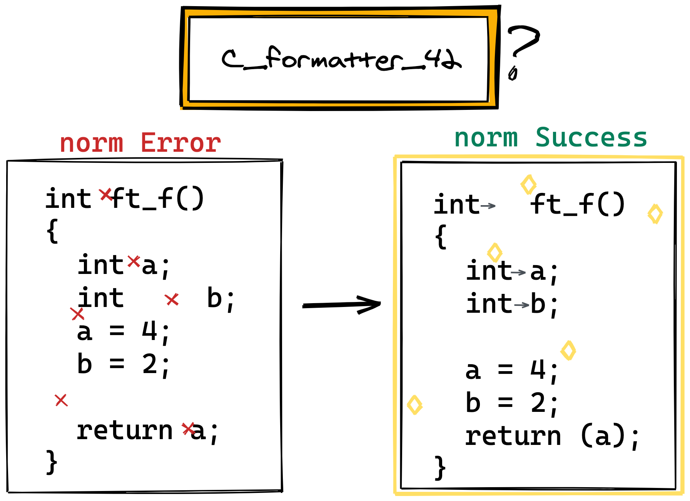

<div align="right">
  <details>
    <summary >🌐 Language</summary>
    <div>
      <div align="center">
        <a href="https://openaitx.github.io/view.html?user=dawnbeen&project=c_formatter_42&lang=en">English</a>
        | <a href="https://openaitx.github.io/view.html?user=dawnbeen&project=c_formatter_42&lang=zh-CN">简体中文</a>
        | <a href="https://openaitx.github.io/view.html?user=dawnbeen&project=c_formatter_42&lang=zh-TW">繁體中文</a>
        | <a href="https://openaitx.github.io/view.html?user=dawnbeen&project=c_formatter_42&lang=ja">日本語</a>
        | <a href="https://openaitx.github.io/view.html?user=dawnbeen&project=c_formatter_42&lang=ko">한국어</a>
        | <a href="https://openaitx.github.io/view.html?user=dawnbeen&project=c_formatter_42&lang=hi">हिन्दी</a>
        | <a href="https://openaitx.github.io/view.html?user=dawnbeen&project=c_formatter_42&lang=th">ไทย</a>
        | <a href="https://openaitx.github.io/view.html?user=dawnbeen&project=c_formatter_42&lang=fr">Français</a>
        | <a href="https://openaitx.github.io/view.html?user=dawnbeen&project=c_formatter_42&lang=de">Deutsch</a>
        | <a href="https://openaitx.github.io/view.html?user=dawnbeen&project=c_formatter_42&lang=es">Español</a>
        | <a href="https://openaitx.github.io/view.html?user=dawnbeen&project=c_formatter_42&lang=it">Italiano</a>
        | <a href="https://openaitx.github.io/view.html?user=dawnbeen&project=c_formatter_42&lang=ru">Русский</a>
        | <a href="https://openaitx.github.io/view.html?user=dawnbeen&project=c_formatter_42&lang=pt">Português</a>
        | <a href="https://openaitx.github.io/view.html?user=dawnbeen&project=c_formatter_42&lang=nl">Nederlands</a>
        | <a href="https://openaitx.github.io/view.html?user=dawnbeen&project=c_formatter_42&lang=pl">Polski</a>
        | <a href="https://openaitx.github.io/view.html?user=dawnbeen&project=c_formatter_42&lang=ar">العربية</a>
        | <a href="https://openaitx.github.io/view.html?user=dawnbeen&project=c_formatter_42&lang=fa">فارسی</a>
        | <a href="https://openaitx.github.io/view.html?user=dawnbeen&project=c_formatter_42&lang=tr">Türkçe</a>
        | <a href="https://openaitx.github.io/view.html?user=dawnbeen&project=c_formatter_42&lang=vi">Tiếng Việt</a>
        | <a href="https://openaitx.github.io/view.html?user=dawnbeen&project=c_formatter_42&lang=id">Bahasa Indonesia</a>
      </div>
    </div>
  </details>
</div>

<p align="center">
  <a style="text-decoration:none" href="https://badge.fury.io/py/c-formatter-42"></a>
  <a style="text-decoration:none" href="https://github.com/dawnbeen/c_formatter_42/actions"></a>
  <a style="text-decoration:none" href="https://github.com/dawnbeen/c_formatter_42/actions"></a>
  <a style="text-decoration:none" href="https://pypi.org/project/c-formatter-42/"></a>
</p>

<br />

<p align="center">
  
</p>

# c_formatter_42

C language prettier that conforms to 42 norm v3.
I know you are already a good human norm.
It's just for convenience.

## Installation

Requires Python3.8+ (3.9, 3.10, 3.11, 3.12)

### From PyPI

```sh
pip3 install c-formatter-42
pip3 install --user c-formatter-42  # If you don't have root privileges
```

If you're on Ubuntu 22.04 or newer (or any Debian-based system with PEP 668 enabled), you might see an error like:

`error: externally-managed-environment`

To fix this, add the `--break-system-packages` flag:

```sh
pip3 install --break-system-packages c-formatter-42
```

### From source

```sh
git clone https://github.com/cacharle/c_formatter_42
cd c_formatter_42
pip3 install -e .
```

## Usage

### Command line

```sh
c_formatter_42 < file.c
python3 -m c_formatter_42 < file.c  # If you get 'command not found' with the previous one

c_formatter_42 --help
usage: c_formatter_42 [-h] [-c] [FILE [FILE ...]]

Format C source according to the norm

positional arguments:
  FILE           File to format inplace, if no file is provided read STDIN

optional arguments:
  -h, --help     show this help message and exit
  -c, --confirm  Ask confirmation before overwriting any file
```

## Plugins / Extensions

### Vim

Check out the [`c_formatter_42.vim`](https://github.com/cacharle/c_formatter_42.vim) plugin. This plugin automatically installs the `c_formatter_42` package using pip.

### Visual Studio Code

1. Install `c_formatter_42`
1. Install the [`keyhr.42-c-format`](https://marketplace.visualstudio.com/items?itemName=keyhr.42-c-format) extension
1. Set `keyhr.42-c-format` as the default formatter for C files in `.vscode/settings.json`

```json
{
  "[c]": {
    "editor.defaultFormatter": "keyhr.42-c-format"
  }
}
```

## Contributing

Feel free to report issues or contribute. :)

### Run the tests

```sh
pip3 install tox
tox
tox -e py311  # for a specific python version
```

### Deploy a new version

```sh
pip3 install bumpversion
bumpversion [major|minor|patch]
git push
git push --tags
```

Go to: <https://github.com/dawnbeen/c_formatter_42/tags> and click on the tag you just created.
Then click on `Create release from tag`, the pipeline will build and deploy that version for you.
