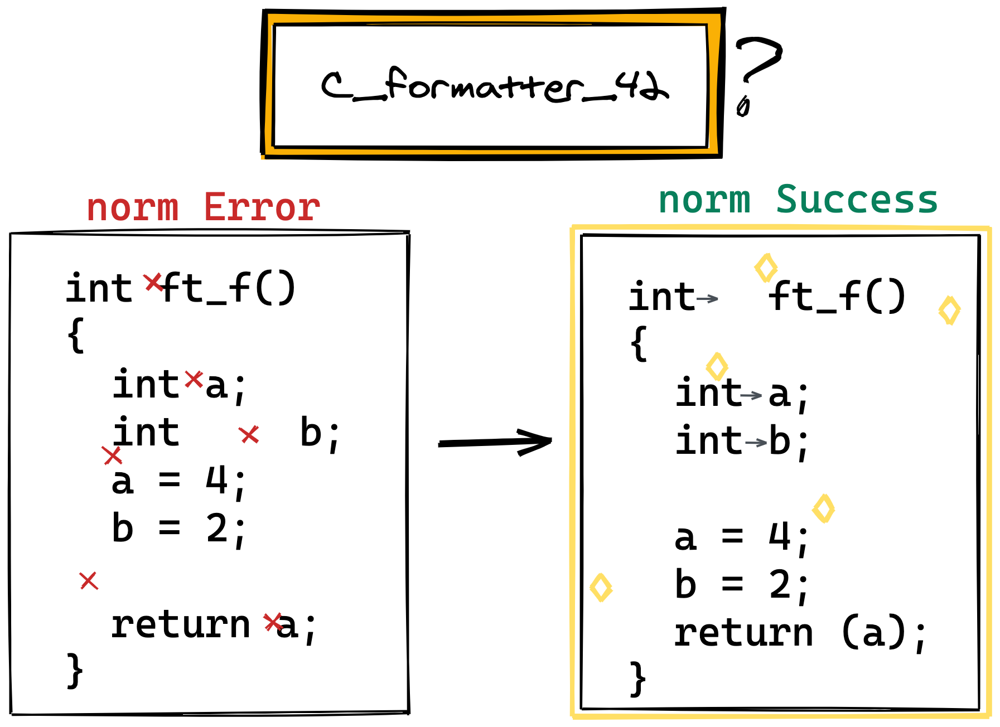

# c\_formatte\_42 [](https://pypi.org/project/c-formatter-42/)



# Intro

It is Prettier of C for 42.
I know you are already a good Human norm.
It's just for convenience.


## Vim

Checkout [c\_formatter\_42.vim](https://github.com/cacharle/c_formatter_42.vim)


## VSCode

1. Install clang-format.

- MacOS
```
$ brew install clang-format
```
 Or you can install vscode extension `Clang-Format`


2. Copy `.clang-format` in your Workspace directory.


3. VSCode Settings
- Set Default Formatter as clang-format.
- Turn off `Format On Paste`, `Format On Save`.
- Or You can just copy this in your `.vscode/settings.json` file.
```
"editor.defaultFormatter": "xaver.clang-format",
"editor.formatOnPaste": false,
"editor.formatOnSave": false,
```
##### 🚨 **CAUTION** Check your **clang-format version**.
If version is lower than 10, `SpaceBeforeSquareBrackets: false` and `AllowShortBlocksOnASingleLine: Never` can't work well.
So you should comment them out!)

4. Execute code formatting
- On Windows: Shift + Alt + F
- On Mac: Shift + Option + F
- On Linux: Ctrl + Shift + I


#### 🚨Caution(VSCode)

It's not perfect.
**You should format these rules MANUALLY after auto-formatting.**
- `global aligned`
- `declarations aligned`
- `declarations must be followed by one empty line`
- `Empty line`
```
int         aaaa = 12;
float       b = 23;
std::string ccc = 23;
```

Recommended to set in `Workspace Preference`.

---

## Command line tool

### Installation

#### pip

```
$ pip3 install c-formatter-42
```

#### Manual

```
$ git clone https://github.com/dawnbeen/c_formatter_42
$ cd c_formatter_42
$ pip3 install -e .
```

### Usage

```
$ c_formatter_42 < file.c
$ python3 -m c_formatter_42 < file.c  # If you get 'command not found' with the previous one

$ c_formatter_42 --help
usage: c_formatter_42 [-h] [-c] [FILE [FILE ...]]

Format C source according to the norm

positional arguments:
  FILE           File to format inplace, if no file is provided read STDIN

optional arguments:
  -h, --help     show this help message and exit
  -c, --confirm  Ask confirmation before overwritting any file
```

Feel free to report issues or contribute. :)
